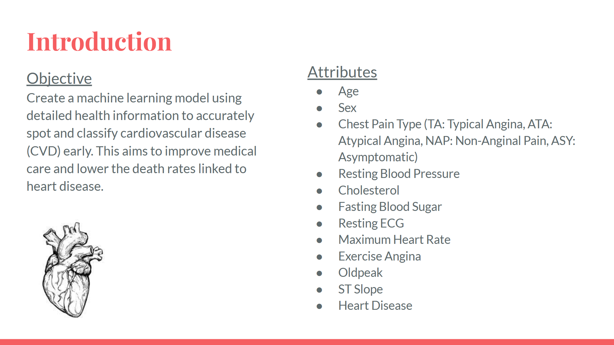
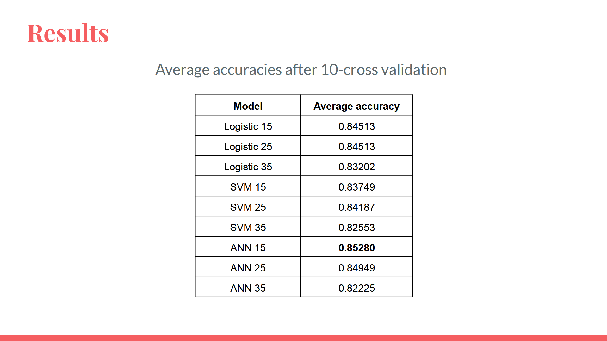
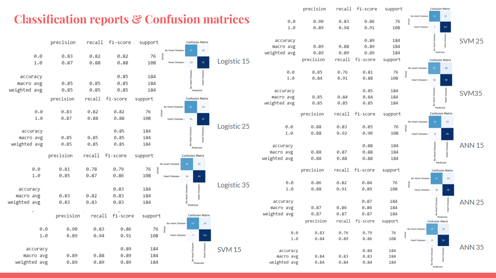
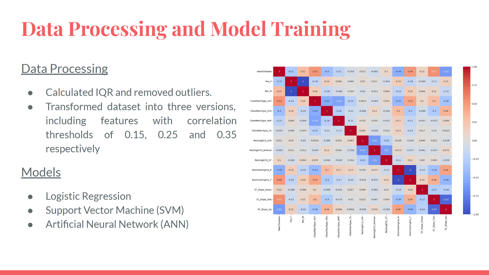

---

# ❤️ AI-Powered Heart Disease Prediction Website

📌 **Example MP4 Demonstration:**
<p align="left">
  <video width="650" autoplay loop muted playsinline>
    <source src="images/VideoDemo.mp4" type="video/mp4">
  </video>
</p>

## 📌 Overview
This web-based **heart disease prediction application** utilizes **machine learning models** to analyze user-input health data and determine the likelihood of heart disease. The system integrates a **neural network (ANN)** alongside other classification models to provide an accurate and user-friendly platform for health risk assessment.

Developed using **Python, Flask, HTML, CSS, JavaScript, and machine learning models**, this application aims to make **early detection of cardiovascular disease** more accessible and effective.  

---

## 🎯 Key Features

### 🔍 1. Objective & Dataset
- This model is designed to **predict heart disease** based on various health factors such as **age, cholesterol levels, blood pressure, and heart rate**.
- The dataset is a **combination of five heart-related datasets**, creating one of the most extensive heart disease datasets with **918 unique patient records** and **11 key health attributes**.

📌 **Project Introduction & Dataset Attributes:**
<p align="left">
  
</p>

---

### 💻 2. Website User Interface
- **Simple and intuitive interface** for users to input health data.
- **One-click prediction button** for instant results.
- **Automated Testing Feature** for bulk predictions.

📌 **Website Interface Screenshot:**
<p align="left">
  
</p>

---

### 🧠 3. Machine Learning Models
- Implemented **Logistic Regression, Support Vector Machine (SVM), and Artificial Neural Networks (ANN)**.
- **10-Fold Cross Validation** to prevent overfitting and ensure high accuracy.
- **Hyperparameter tuning** used to optimize the ANN model.
- **Feature selection** based on correlation analysis.

📌 **Model Performance Results:**
<p align="left">
  
</p>

📌 **Classification Reports & Confusion Matrices:**
<p align="left">
  
</p>

---

### ⚙️ 4. Data Processing & Training Pipeline
- **Data Cleaning & Preprocessing:**
  - Handled missing values and outliers.
  - Standardized numerical features.
  - One-hot encoding for categorical variables.

- **Training the Models:**
  - Used **scikit-learn** and **TensorFlow/Keras** for model training.
  - Optimized training using **gradient descent and backpropagation**.
  - Applied **dropout layers** to improve ANN generalization.

📌 **Data Processing & Training Workflow:**
<p align="left">
  
</p>

---

## 🛠️ Installation & Setup Guide

### 🔑 Prerequisites
Before proceeding, ensure you have the following installed:
- **Python 3.x**
- Required dependencies in `requirements.txt` (Flask, NumPy, Pandas, Scikit-Learn, TensorFlow, etc.)

### 🚀 Setup Instructions
1️⃣ **Clone the Repository**
   ```sh
   git clone https://github.com/your-repo/heart-disease-prediction.git
   cd heart-disease-prediction
   ```

2️⃣ **Install Dependencies**
   ```sh
   pip install -r requirements.txt
   ```

3️⃣ **Run the Application**
   ```sh
   cd Website
   python app.py
   ```

4️⃣ **Access the Website**
   - Once running, open your browser and navigate to:
     ```
     http://127.0.0.1:5000
     ```

---

## ⚡ Project Structure

```
📂 Heart-Risk-ANN-Model_Website
│── 📂 Model
│   │── Models.ipynb               # Jupyter Notebook for training models
│   │── heart.csv                  # Dataset used for training
│
│── 📂 Website
│   │── 📂 static                   # Static files (CSS, JavaScript)
│   │── 📂 templates                # HTML templates
│   │── README.txt                  # Additional project documentation
│   │── app.py                      # Flask web application
│   │── final_model.ipynb           # Final model training notebook
│   │── heart.csv                   # Duplicate dataset for website integration
│   │── model.py                    # Model inference and predictions
│   │── model15.pkl                  # Trained model - Version 1
│   │── model25.pkl                  # Trained model - Version 2
│   │── model35.pkl                  # Trained model - Version 3
│
│── .gitignore                       # Ignore unnecessary files
│── README.md                        # Project documentation
```

---

## 🔍 How It Works
1. **User Inputs Health Data**: The user provides details like **age, cholesterol levels, heart rate**, etc.
2. **Machine Learning Model Predicts Outcome**: The selected **neural network** or classification model processes the input.
3. **Results Displayed Instantly**: The prediction appears on the webpage, indicating whether the user is at risk for heart disease.
4. **Automated Testing Mode**: Users can run multiple test cases automatically to validate model accuracy.

---

## 📊 Model Performance & Evaluation
- **Logistic Regression Accuracy**: ~84.5%
- **SVM Accuracy**: ~84.2%
- **Artificial Neural Network (ANN) Accuracy**: **85.3%**
- **Confusion Matrices & Classification Reports** provide a breakdown of precision, recall, and F1-scores.

---

## 🚀 Future Improvements
🔹 **Enhancing Model Accuracy**: Exploring deeper **neural networks with more layers**.  
🔹 **Adding More User Inputs**: Incorporating additional **risk factors** for better prediction.  
🔹 **Deploying on Cloud**: Hosting on **AWS/GCP for public access**.  
🔹 **Implementing a Mobile App Version** 📱.  

---

## 📜 License
This project is licensed under the **MIT License**.

---
